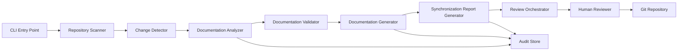

# Automated Documentation Sync — Architecture

## 1. System Overview

Automated Documentation Sync is a single-repository documentation synchronization system that analyzes repository changes, assesses documentation impact, validates documentation consistency, and produces review-ready documentation recommendations. The architecture is intentionally conservative: it generates recommendations and reports, but it does not overwrite existing documentation automatically and does not commit documentation changes without explicit human approval.

The system is designed for a Git-based repository and Markdown-first deliverables. Its core objective is to reduce documentation drift while preserving safety, determinism, and auditability.

## 2. Component Diagram

## 3. Technology Stack

- Node.js
  - Suitable for CLI-based repository analysis and deterministic workflow execution.

- TypeScript
  - Provides type-safe contracts across the pipeline and improves maintainability.

- Git
  - Serves as the repository source of truth for repository scanning and change detection.

- GitHub
  - Provides the repository hosting, permissions model, and review-friendly workflow boundary.

- Markdown
  - The required output format for generated documentation and synchronization reporting.

- GitHub Actions
  - Optional automation entry point for CI/CD-style workflows.

## 4. Data Flow

1. The CLI entry point receives the repository context and execution options.
2. The repository scanner enumerates repository files and identifies source and documentation artifacts.
3. The change detector compares current repository state against the known baseline or repository history.
4. The documentation analyzer classifies current documentation as consistent, missing, outdated, or uncertain.
5. The validator applies confidence and quality gates to proposed documentation changes.
6. The documentation generator produces review-ready Markdown recommendations for supported documentation targets.
7. The synchronization report generator creates a deterministic Markdown summary with changed files, warnings, skipped items, and execution details.
8. The review orchestrator packages the proposed changes and blocks automated overwrite until a human reviewer approves the output.
9. The audit store records run metadata, artifacts, warnings, and approval state for traceability.

## 5. Major Components and Responsibilities

### Repository Scanner
- Enumerates source files, documentation files, and repository structure.
- Produces a normalized repository model that downstream components can consume consistently.

### Change Detector
- Identifies modified source files.
- Supports repository state comparison and Git-backed drift analysis.

### Documentation Analyzer
- Classifies existing documentation according to whether it is up-to-date, outdated, missing, or uncertain.
- Produces the evidence needed to decide whether documentation must be regenerated or reviewed manually.

### Documentation Validator
- Applies safety checks to proposed documentation updates.
- Prevents low-confidence or ambiguous output from being treated as an approved change.

### Documentation Generator
- Creates recommended documentation updates in Markdown form.
- Operates conservatively and only drafts content when the confidence level is acceptable.

### Synchronization Report Generator
- Produces the final Markdown synchronization report.
- Includes warnings, unchanged documentation skips, and a deterministic execution summary.

### Review Orchestrator
- Coordinates the review-before-commit behavior.
- Ensures that report generation and validation complete before any documentation update is treated as final.

### Audit Store
- Records synchronization run metadata, generated artifacts, warnings, and approval state.
- Preserves traceability for each run.

## 6. Error Handling Approach

The architecture uses a fail-safe, warning-driven approach:

- Missing repositories or required files must raise a clear execution error and stop the run.
- Missing documentation is not treated as a hard failure; it is surfaced as a warning and reported in the synchronization output.
- Unchanged documentation is skipped deterministically rather than rewritten.
- Low-confidence recommendations are not auto-applied and are instead flagged for manual review.
- Report generation remains deterministic so that the same repository state produces stable output.

## 7. Security Considerations

- Repository permissions remain the authoritative control for who can approve and commit changes.
- The system must never overwrite existing documentation automatically without human review.
- Generated reports should avoid exposing sensitive repository details beyond the minimum required for review.
- The architecture assumes GitHub-native permission controls and branch-based review discipline.
- Audit records are used to preserve a traceable chain of execution and approval.

## 8. Extension Points

The architecture supports future expansion without changing the MVP’s baseline safety model:

- Pluggable repository scanners for additional repository layouts or metadata sources.
- Alternative documentation analyzers for stricter semantic evaluation.
- Additional generators for more documentation targets beyond the current MVP scope.
- Alternate report formats for machine-readable or downstream workflow integration.
- CI/CD wrappers that re-use the same orchestration and validation pipeline.

## 9. Architectural Assumptions

- The solution operates on a single Git repository in the MVP.
- Repository documentation is primarily Markdown-based.
- Documentation changes are reviewed before they become authoritative repository content.
- The execution model is in-memory for the MVP and does not require external services.
- The system is intended to be modular, testable, and deterministic.
- The MVP scope excludes automated Git commits, PR creation, Confluence publishing, wiki synchronization, AI-generated content, multi-repository orchestration, and cloud deployment.

- Use Git as the immutable source of truth for final approved changes.

## 11. Scalability Considerations

The MVP architecture is intentionally scoped for a single repository and moderate repository size. Scalability is handled in a conservative, layered manner.

### Horizontal Scaling
- The platform can run multiple sync jobs concurrently for different repositories in a future release.
- The architecture can support repository-specific workers without redesign.

### Vertical Scaling
- The analysis and generation phases can be optimized through incremental file hashing, metadata caching, and selective regeneration.

### Operational Scaling
- By keeping the architecture modular, future support can be added for multi-repository orchestration, richer metadata sources, and more advanced generation backends.

### Current MVP Limitations
- Performance is tuned for small to medium repositories.
- The architecture is not designed for enterprise-wide documentation federation in version 1.

## 12. Risks and Mitigation

### Risk 1: Incorrect documentation generation
Mitigation:
- Conservative generation rules
- Low-confidence fallback to skip and warn
- Mandatory human approval before commit

### Risk 2: Documentation drift remains unresolved
Mitigation:
- Strong change detection based on repository state and Git history
- Explicit handling of missing or stale sections
- Generation of review-ready diffs for effective human review

### Risk 3: CI/CD execution instability
Mitigation:
- Deterministic document generation pipeline
- Clear validation and reporting step
- Fail-safe behavior for uncertain outputs

### Risk 4: Poor repository hygiene reduces quality
Mitigation:
- Repository assumptions are explicitly documented
- Missing metadata or weak comments are treated as low-confidence inputs
- Manual refinement remains a supported fallback

### Risk 5: Security misconfiguration
Mitigation:
- GitHub permission alignment
- Approval state enforcement
- Audit log persistence

### Risk 6: Review workflow slows delivery
Mitigation:
- Keep the approval model lightweight and GitHub-native
- Generate concise, focused review packages instead of broad, noisy diffs
- Support both CLI and CI/CD entry points so the process remains operationally flexible

## 13. Design Decisions

### Decision 1: Review-before-commit is a mandatory architectural control
This is the central safety control for the product. It prevents the system from publishing incorrect or speculative documentation automatically.

### Decision 2: The architecture is repository-centric, not platform-centric
The first release is designed for one Git repository and one Markdown documentation model rather than enterprise-wide documentation ecosystems.

### Decision 3: The system is conservative by default
If a section cannot be confidently updated, the system skips it and flags the issue. This prioritizes trustworthiness over volume of automation.

### Decision 4: Git and GitHub are the source-of-truth operational mechanism
Git history and repository permissions provide the baseline for change detection, auditability, approvals, and change persistence.

### Decision 5: Execution is both manual and automated
A CLI path supports developer-driven execution while GitHub Actions supports process automation in CI/CD.

## 14. Future Enhancements

### Repository Expansion
- Support multiple repositories and cross-repo documentation synchronization.
- Add repository grouping and shared documentation ownership models.

### More Intelligent Generation
- Introduce repository-specific templates and stronger documentation style rules.
- Add semantic understanding of code modules and API surfaces.

### Richer Workflow Integration
- Extend support for pull-request comments, custom review states, and policy enforcement.
- Add release-note generation and templated documentation governance.

### Enterprise Integration
- Support broader governance, approval workflow, and audit-export capabilities.
- Introduce controlled interop with external documentation platforms where appropriate.

## Architecture Summary

The proposed architecture is a safe, production-ready, Git-native documentation synchronization system that combines repository analysis, documentation generation, review orchestration, and audited Git commit behavior. It is intentionally scoped for a single repository, Markdown outputs, Node.js and TypeScript, and a human approval gate before commit. This constraint-driven design ensures the system remains reliable, auditable, and aligned with the project’s MVP goals.
