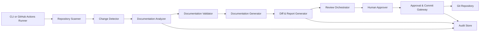

# Automated Documentation Sync — Architecture

## 1. Architecture Overview

Automated Documentation Sync is a production-ready documentation synchronization system designed for a single Git repository. Its purpose is to continuously analyze repository changes, detect documentation drift, generate review-ready documentation updates, and route those updates through a human approval workflow before any commit is made.

The architecture follows a conservative, safety-focused model:
- Source changes are discovered from repository state and Git history.
- Documentation content is generated from code structure, metadata, comments, and existing docs.
- Proposed updates are assembled into a reviewable package containing diffs, warnings, and change summaries.
- Approved updates are committed via Git, while audit records preserve traceability.

The design deliberately prioritizes correctness over aggressive automation. When confidence is low, the system skips or flags content for manual review rather than generating potentially misleading documentation.

## 2. Architecture Goals

The architecture is designed to achieve the following goals:

- Keep project documentation synchronized with the current source code.
- Reduce manual documentation maintenance effort.
- Maintain a clear review-before-commit workflow.
- Ensure safety, reliability, and auditability.
- Support both CLI-driven and CI/CD-driven execution.
- Keep the first release scoped to a single GitHub repository and Markdown-based documentation.
- Enable future extensibility for richer integrations, more sophisticated generators, and broader repository support.

### Quality Attributes
The architecture explicitly prioritizes the following quality attributes:
- Accuracy: documentation must be trustworthy and conservative when confidence is low.
- Safety: no low-confidence documentation should be committed automatically.
- Auditability: every synchronization run and approval decision must leave a traceable record.
- Usability: proposed documentation changes must be easy to review in Markdown and GitHub-native workflows.
- Reliability: the system should behave predictably across both manual and CI/CD execution modes.
- Performance: the design should support small-to-medium repository synchronization within the stated target.

## 3. High-Level Architecture

The application is organized as a layered, event-driven architecture built around a central orchestration pipeline.

### Architectural Style
- Modular service-oriented internal architecture
- Pipeline-based orchestration
- Human-in-the-loop approval model
- Git-native operational model

### Primary Layers
1. Repository Access Layer
   - Connects to the Git repository and reads source and documentation content.

2. Analysis and Intelligence Layer
   - Scans repository contents.
   - Detects code changes.
   - Detects documentation drift.
   - Produces structured analysis output.

3. Documentation Generation Layer
   - Builds updated documentation drafts.
   - Produces Markdown output.
   - Creates summaries and warnings.

4. Review and Approval Layer
   - Presents proposed diffs and synchronization reports.
   - Requires explicit human approval before commit.

5. Delivery and Audit Layer
   - Commits approved documentation updates.
   - Records upload, change, and workflow metadata for traceability.

## 4. Technology Stack with Justification

### Core Technology
- Node.js
  - Suitable for command-line tooling and CI/CD automation.
  - Strong ecosystem support for file system and Git integration.
  - Easy to package for both local and workflow execution.

- TypeScript
  - Improves maintainability, type safety, and long-term code quality.
  - Helps enforce contracts across scanning, analysis, generation, validation, and reporting components.

### Repository and Workflow Tools
- Git
  - Required source-of-truth version control mechanism.
  - Supports diff-based analysis, commit history inspection, and change tracking.

- GitHub
  - Aligns with the repository and workflow requirements.
  - Enables permissions enforcement and branch-based review patterns.

- GitHub Actions
  - Provides the production-ready automation mechanism for event-driven synchronization.
  - Supports code-change-triggered execution in a CI/CD model.

### Documentation and Artifact Standards
- Markdown
  - Native output format required by the project.
  - Easy to render, diff, and review in GitHub-based workflows.

- JSON or structured metadata reports
  - Used for audit records, synchronization summaries, and machine-readable status storage.

### Supporting Runtime Characteristics
- Stateless processing model for each synchronization run
- File-based artifact generation for reports, diffs, and warnings
- Externalized configuration for repository rules, supported documentation targets, and approval policies
- GitHub-native permission model to preserve review authority and security boundaries

## 5. Major Components and Responsibilities

### 5.1 Repository Scanner
Responsible for discovering repository structure, source files, metadata files, and documentation files. It identifies supported file groups and supplies a normalized repository model to downstream components.

### 5.2 Change Detector
Responsible for identifying source code changes since the previous synchronization cycle. It compares current repository state with the prior baseline using repository state and Git history metadata.

### 5.3 Documentation Analyzer
Responsible for reviewing existing documentation and classifying sections into:
- Up-to-date
- Outdated
- Missing
- Uncertain

This component provides the basis for safe change generation.

### 5.4 Documentation Generator
Responsible for producing proposed Markdown content for supported documentation targets. It should operate conservatively and only synthesize content when confidence is acceptable.

### 5.5 Documentation Validator
Responsible for confirming that generated documentation meets minimum confidence and quality thresholds. It flags sections that are unsafe, ambiguous, or unsupported for automatic update.

### 5.6 Diff and Report Generator
Responsible for creating human-readable documentation differences, warnings, skipped sections, and a synchronization summary report.

### 5.7 Review Orchestrator
Responsible for coordinating the review-before-commit process. It packages generated updates, creates review artifacts, and blocks commit execution until human approval is recorded.

### 5.8 Approval and Commit Gateway
Responsible for enforcing approval policy and applying approved documentation changes to the repository using Git-native workflows.

### 5.9 Audit Store
Responsible for persisting synchronization run metadata, file-level change records, generated reports, and approval history for traceability.

### 5.10 CI/CD Execution Runner
Responsible for running synchronization in GitHub Actions or other CI/CD environments. This runner triggers execution on relevant repository events and ensures the same orchestration path is used in both local and automated contexts.

### Implementation Readiness Notes
A future implementation should organize source code into a small set of focused modules such as scanner, detector, analyzer, generator, validator, report, review, git, cli, and entrypoint layers. The current architecture intentionally avoids prescribing a larger framework or enterprise runtime because the MVP requires a lightweight, deterministic CLI-plus-GitHub-Actions design.

## 6. Data Flow

The system operates through the following primary flow:

1. Repository scan
   - The system enumerates repository files and documentation targets.

2. Baseline comparison
   - Current source files are compared with the last known documented state or Git history.

3. Analysis of drift
   - Existing documentation is examined for mismatches, omissions, and stale sections.

4. Draft generation
   - Proposed documentation updates are generated in review-ready Markdown format.

5. Validation and confidence checks
   - Low-confidence sections are skipped and flagged with warnings.

6. Review package creation
   - The system generates a report that includes changed files, warnings, skipped sections, and a summary.

7. Human approval
   - Authorized users approve the proposed documentation updates.

8. Commit and audit record
   - Approved documentation is committed to the repository and recorded in the audit trail.

## 7. Component Interaction

The runtime interaction model is a pipeline with bounded interfaces between components:

- The Repository Scanner provides a normalized repository model.
- The Change Detector supplies changed-file metadata.
- The Documentation Analyzer evaluates the current documentation state.
- The Documentation Validator applies confidence and quality checks to proposed content.
- The Documentation Generator creates proposal outputs only for accepted or high-confidence sections.
- The Diff and Report Generator transforms proposals into review artifacts.
- The Review Orchestrator coordinates approval gating and produce a blocked/approved execution state.
- The Approval and Commit Gateway performs Git-based application only after approval.
- The Audit Store records the full workflow state for traceability.
- The CLI and GitHub Actions runners provide two execution entry points that reuse the same orchestration pipeline.

This loose coupling keeps the architecture maintainable and supports the future addition of different generation strategies without redesigning the full system.

## 8. Mermaid Component Diagram

## 9. Deployment Architecture

### Runtime Deployment Model
The application will be deployed as a CLI-first system with optional CI/CD execution support.

### Recommended Deployment Pattern
- Local execution for developers and technical writers through a CLI entrypoint
- GitHub Actions workflow execution for automatic triggers on repository events
- GitHub-based repository access and repository permissions for write protection
- A single execution agent per repository sync request, reusing the same orchestration pipeline in both modes

### Deployment Topology
- One execution agent per repository sync request
- File-based outputs stored as transient artifacts during the synchronization run
- A GitHub repository as the persistent system of record for documentation changes
- Approval and commit steps executed through GitHub review and branch-merge conventions

### Operational Considerations
- The system should be idempotent for the same repository state.
- Execution should be isolated to a single repository context for the MVP.
- Review artifacts should remain easy to inspect in pull-request or commit review workflows.
- The workflow should support a deterministic "generate report, review, approve, commit" sequence.

## 10. Security Considerations

### Access Control
- Use GitHub repository permissions as the source of truth for who can review and approve documentation changes.
- Limit commit rights to authorized users only.
- Keep read-only access for stakeholders and non-authorizing roles.

### Documentation Safety
- Prevent automatic commit of low-confidence or unreviewed generated output.
- Do not expose sensitive repository information in generated reports or documentation summaries.
- Apply content filters and validation rules to avoid accidental disclosure of confidential details.

### Integrity
- Maintain a clear audit trail for every synchronization run.
- Track which files changed, when, and by which reviewed workflow state.
- Use Git as the immutable source of truth for final approved changes.

## 11. Scalability Considerations

The MVP architecture is intentionally scoped for a single repository and moderate repository size. Scalability is handled in a conservative, layered manner.

### Horizontal Scaling
- The platform can run multiple sync jobs concurrently for different repositories in a future release.
- The architecture can support repository-specific workers without redesign.

### Vertical Scaling
- The analysis and generation phases can be optimized through incremental file hashing, metadata caching, and selective regeneration.

### Operational Scaling
- By keeping the architecture modular, future support can be added for multi-repository orchestration, richer metadata sources, and more advanced generation backends.

### Current MVP Limitations
- Performance is tuned for small to medium repositories.
- The architecture is not designed for enterprise-wide documentation federation in version 1.

## 12. Risks and Mitigation

### Risk 1: Incorrect documentation generation
Mitigation:
- Conservative generation rules
- Low-confidence fallback to skip and warn
- Mandatory human approval before commit

### Risk 2: Documentation drift remains unresolved
Mitigation:
- Strong change detection based on repository state and Git history
- Explicit handling of missing or stale sections
- Generation of review-ready diffs for effective human review

### Risk 3: CI/CD execution instability
Mitigation:
- Deterministic document generation pipeline
- Clear validation and reporting step
- Fail-safe behavior for uncertain outputs

### Risk 4: Poor repository hygiene reduces quality
Mitigation:
- Repository assumptions are explicitly documented
- Missing metadata or weak comments are treated as low-confidence inputs
- Manual refinement remains a supported fallback

### Risk 5: Security misconfiguration
Mitigation:
- GitHub permission alignment
- Approval state enforcement
- Audit log persistence

### Risk 6: Review workflow slows delivery
Mitigation:
- Keep the approval model lightweight and GitHub-native
- Generate concise, focused review packages instead of broad, noisy diffs
- Support both CLI and CI/CD entry points so the process remains operationally flexible

## 13. Design Decisions

### Decision 1: Review-before-commit is a mandatory architectural control
This is the central safety control for the product. It prevents the system from publishing incorrect or speculative documentation automatically.

### Decision 2: The architecture is repository-centric, not platform-centric
The first release is designed for one Git repository and one Markdown documentation model rather than enterprise-wide documentation ecosystems.

### Decision 3: The system is conservative by default
If a section cannot be confidently updated, the system skips it and flags the issue. This prioritizes trustworthiness over volume of automation.

### Decision 4: Git and GitHub are the source-of-truth operational mechanism
Git history and repository permissions provide the baseline for change detection, auditability, approvals, and change persistence.

### Decision 5: Execution is both manual and automated
A CLI path supports developer-driven execution while GitHub Actions supports process automation in CI/CD.

## 14. Future Enhancements

### Repository Expansion
- Support multiple repositories and cross-repo documentation synchronization.
- Add repository grouping and shared documentation ownership models.

### More Intelligent Generation
- Introduce repository-specific templates and stronger documentation style rules.
- Add semantic understanding of code modules and API surfaces.

### Richer Workflow Integration
- Extend support for pull-request comments, custom review states, and policy enforcement.
- Add release-note generation and templated documentation governance.

### Enterprise Integration
- Support broader governance, approval workflow, and audit-export capabilities.
- Introduce controlled interop with external documentation platforms where appropriate.

## Architecture Summary

The proposed architecture is a safe, production-ready, Git-native documentation synchronization system that combines repository analysis, documentation generation, review orchestration, and audited Git commit behavior. It is intentionally scoped for a single repository, Markdown outputs, Node.js and TypeScript, and a human approval gate before commit. This constraint-driven design ensures the system remains reliable, auditable, and aligned with the project’s MVP goals.
